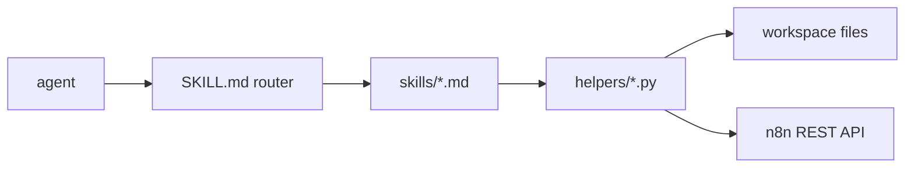

# N8N EVOL I

A harness to help coding agents build, deploy, maintain, and debug multi-workflow n8n-powered automation systems.

## Features

- **Multi-environment workflows.** Per-env YAML in `n8n-config/<env>.yml` (instance URL, workflow IDs, credential refs); every helper accepts `--env`. See [`bootstrap-env.md`](skills/bootstrap-env.md).

  ```yaml
  # n8n-config/dev.yml
  instance: acme.dev.n8n.cloud
  envSuffix: " (dev)"          # appended to every workflow name
  workflows:
    lead_enrichment:
      id: wf_def456
      displayName: "Lead Enrichment"
    lead_persister:
      id: wf_abc123
      displayName: "Lead Persister"
  ```

- **Build-time substitution.** Code, prompts, schemas, templates, and env values live in workspace files; `{{@:js|py|txt|json|html|env|uuid:...}}` placeholders are substituted at deploy time. Template-stable round-trips. See [`code-node-discipline.md`](skills/patterns/code-node-discipline.md).

  ```jsonc
  // n8n-workflows-template/lead_enrichment.template.json
  {
    "name": "{{@:env:workflows.lead_enrichment.displayName}}{{@:env:envSuffix}}",
    "nodes": [
      {
        "name": "Webhook",
        "type": "n8n-nodes-base.webhook",
        "parameters": { "path": "lead", "httpMethod": "POST" }
      },
      {
        "name": "Score Lead",
        "type": "@n8n/n8n-nodes-langchain.openAi",
        "parameters": {
          "messages": [
            { "role": "system", "content": "{{@:txt:n8n-prompts/prompts/score_lead.txt}}" }
          ]
        }
      },
      {
        "name": "Normalize Fields",
        "type": "n8n-nodes-base.code",
        "parameters": {
          "jsCode": "{{@:js:n8n-functions/js/normalize_lead.js}}\n\nreturn normalize(items);"
        }
      },
      {
        "name": "Persist via Sub-workflow",
        "type": "n8n-nodes-base.executeWorkflow",
        "parameters": {
          "workflowId": "{{@:env:workflows.lead_persister.id}}"
        }
      }
    ]
  }
  ```

- **Dependency-ordered deployment.** `deploy_all.py` rolls out an env in tier order (set per-workflow in `deployment_order.yml`) so callees deploy before callers. See [`deploy_all.md`](skills/deploy_all.md).

  ```mermaid
  graph LR
    A[tier 0: leaves] --> B[tier 1: handlers] --> C[tier 2: callers]
  ```

- **Execution debugging.** Structured symptom → root-cause flow (dependency graph, candidate pre-screen, causal-linkage, sub-agent cross-check), backed by `list_executions.py`, `inspect_execution.py`, `dependency_graph.py`. See [`investigation-discipline.md`](skills/patterns/investigation-discipline.md).

  ```bash
  python3 $HARNESS/helpers/inspect_execution.py --env dev --id 91234
  ```

- **Distributed locking.** Redis-backed `lock_acquisition` / `lock_release` primitives with an identity-payload sidecar; crashes either self-heal via Redis TTL or are cleaned by the registered `error_handler_lock_cleanup` workflow. See [`locking.md`](skills/patterns/locking.md).

  ```
  ┌──────────┐   ┌──────┐   ┌──────────┐
  │ acquire  │ → │ work │ → │ release  │
  │ (scope)  │   │      │   │ (scope)  │
  └──────────┘   └──────┘   └──────────┘
  ```

- **Rate limiting.** Fixed-window Redis `INCR` primitive; configurable limit, window, and denied-branch behavior (passthrough / stop / error). See [`locking.md`](skills/patterns/locking.md).

  ```
                            ┌─→ work       (within N per window)
  request → check(scope) ───┤
                            └─→ denied     (over limit)
  ```

- **Error handling + observability.** Capture (Error Trigger) → log (sinks fan out in parallel) → process (lock cleanup, DB invalidation, compensating workflows). See [`error-handling.md`](skills/patterns/error-handling.md), [`datadog/`](skills/integrations/datadog/README.md).

  ```
                    ┌─ Sentry  ─┐
  Error Trigger ──→ ├─ Datadog ─┤ ──→ lock cleanup / invalidate / compensate
                    └─ Slack   ─┘
  ```

- **Serverless functions (a.k.a. cloud functions / serverless APIs).** Scaffolds a Python function into a FastAPI service in `cloud-functions/`, auto-registers it in the router, ships with Railway config, callable from n8n via HTTP Request nodes. See [`add-cloud-function.md`](skills/add-cloud-function.md).

  ```bash
  python3 $HARNESS/helpers/add_cloud_function.py --name parse_invoice
  ```

- **DSPy prompt optimization.** Optimize a workspace prompt against its paired schema + dataset (BootstrapFewShot or MIPROv2), eval on structural correctness, optionally write the result back to disk. See [`iterate-prompt.md`](skills/iterate-prompt.md).

  ```bash
  python3 $HARNESS/helpers/iterate_prompt.py --prompt extract_invoice --optimizer mipro_v2
  ```

## Install

| | Skill mode | Plugin mode |
|---|---|---|
| Slash commands | No | Yes (`/n8n-evol-I:*`) |
| Auto-tidy hook | Manual opt-in | Automatic |
| Discovery | Read `SKILL.md` | Claude Code `/help` |
| Other agent runtimes | Yes | Claude Code only |

**Skill mode** (any agent runtime):

```bash
git clone https://github.com/mwamedacen/n8n-evol-I.git ~/.claude/skills/n8n-evol-I
pip install pyyaml requests python-dotenv
```

**Plugin mode** (Claude Code) — adds 10 namespaced slash commands (`/n8n-evol-I:deploy`, `:deploy_all`, `:resync`, `:resync_all`, `:tidyup`, `:debug`, `:run`, `:doctor`, `:validate`, `:test`) plus an auto-tidy hook.

```bash
claude plugin install https://github.com/mwamedacen/n8n-evol-I
```

## Quick start

```bash
HARNESS=~/.claude/skills/n8n-evol-I   # or $CLAUDE_PLUGIN_ROOT in plugin mode
python3 $HARNESS/helpers/init.py
python3 $HARNESS/helpers/bootstrap_env.py --env dev --instance acme.app.n8n.cloud --api-key <key>
python3 $HARNESS/helpers/doctor.py --env dev
```

See [`install.md`](install.md) for prerequisites, optional extras, and update flow.

## Why

Operating n8n past the toy stage exposes the same gaps on every project. The UI editor is fine for a demo and tedious by the third workflow — every code change is click-paste-save, every refactor is manual, every diff is a 200KB JSON blob with code, prompts, schemas, and HTML inlined. A coding agent burns half its context window parsing one file. Two scheduled runs can quietly race on the same record. When something fails at 2am, the execution log tells you *what* broke, not *why*.

N8N EVOL I is the structure that takes those problems off the table.

## How it works

The harness directory is read-only at runtime. The harness operates against your existing project directory — referred to here as `{YOUR_N8N_PROJECT_DIR}` — which becomes the workspace; the agent reads and writes the opinionated subtree (`n8n-config/`, `n8n-workflows-template/`, …) directly inside it, and you version-control it however you want. The agent reads [`SKILL.md`](SKILL.md) to route any n8n request to the right sub-skill, which invokes a standalone Python helper in `helpers/`. No master CLI, no daemon. `validate.py` enforces segmentation discipline before any deploy.



## Workspace layout

`init.py` scaffolds the opinionated default below. If your project already has its own layout, document the mapping in `N8N-WORKSPACE-MEMORY.md` — the agent reads that journal each session and reconciles, so most non-default shapes work fine as long as it can see where each thing actually lives:

```
{YOUR_N8N_PROJECT_DIR}/
├── AGENTS.md                # workspace orientation (read first every session)
├── N8N-WORKSPACE-MEMORY.md  # rolling journal — agent appends as it learns
├── n8n-config/              # env YAML (dev.yml, prod.yml, …) + .env.<env> secrets
├── n8n-workflows-template/  # *.template.json — canonical, version-controlled
├── n8n-build/               # hydrated outputs — gitignored, regenerated on deploy
├── n8n-functions/
│   ├── js/                  # pure JS injected via {{@:js:...}}
│   └── py/                  # pure Python injected via {{@:py:...}}
├── n8n-functions-tests/     # *.test.js / test_*.py — paired tests, validator-required
├── n8n-prompts/
│   ├── prompts/             # *_prompt.txt + *_schema.json
│   ├── datasets/            # *.json for iterate-prompt
│   └── evals/
├── n8n-assets/
│   ├── email-templates/     # *.html injected via {{@:html:...}}
│   ├── images/
│   └── misc/
├── cloud-functions/         # FastAPI service scaffolded by add-cloud-function
│   └── functions/
└── cloud-functions-tests/
```

## Repository layout

| Path | Contents |
|---|---|
| [`SKILL.md`](SKILL.md) | Router — lists all lifecycle, pattern, and integration skills. |
| [`install.md`](install.md) | Prerequisites, install, smoke test, update flow. |
| `skills/` | 27 lifecycle + 13 pattern + 10 integration skills (50 total). |
| `helpers/` | 35 top-level Python helpers + 6 `placeholder/` resolvers. |
| `primitives/workflows/` | Seed templates: `_minimal`, `lock_acquisition`, `lock_release`, `error_handler_lock_cleanup`, `rate_limit_check`. |
| `primitives/cloud-functions/` | FastAPI app seed + Railway config (`app.py`, `registry.py`, `railpack.json`). |
| `primitives/prompts/` | Example prompt + schema for `iterate-prompt`. |
| `tests/` | 200+ offline tests (HTTP mocked) covering every helper, primitive, and pattern. |

## Changelog

See [CHANGELOG.md](CHANGELOG.md).

## License

MIT. See [LICENSE](LICENSE).
